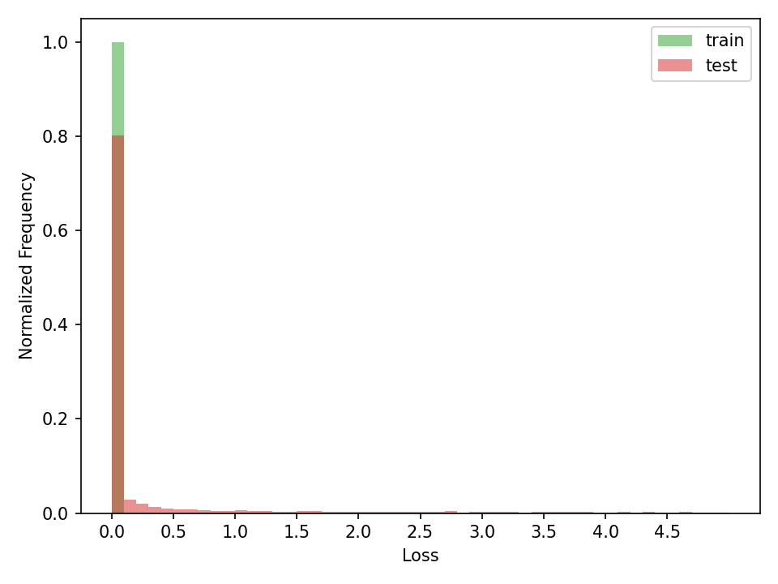
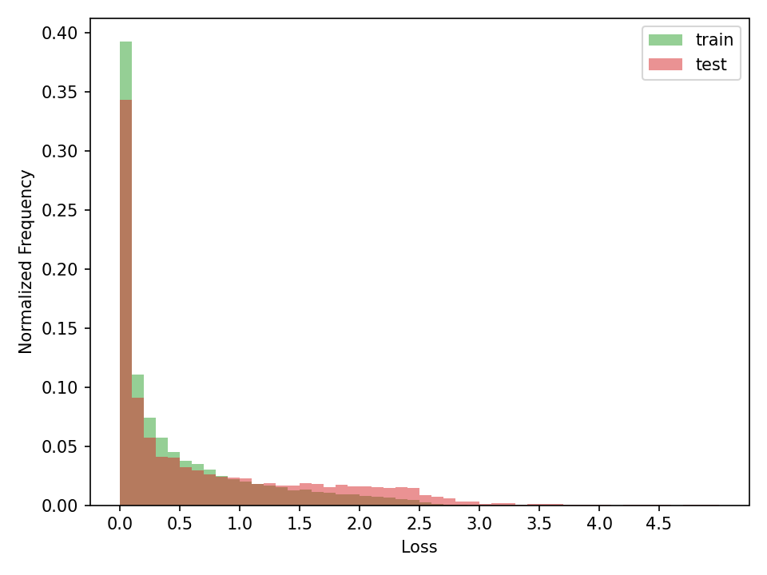
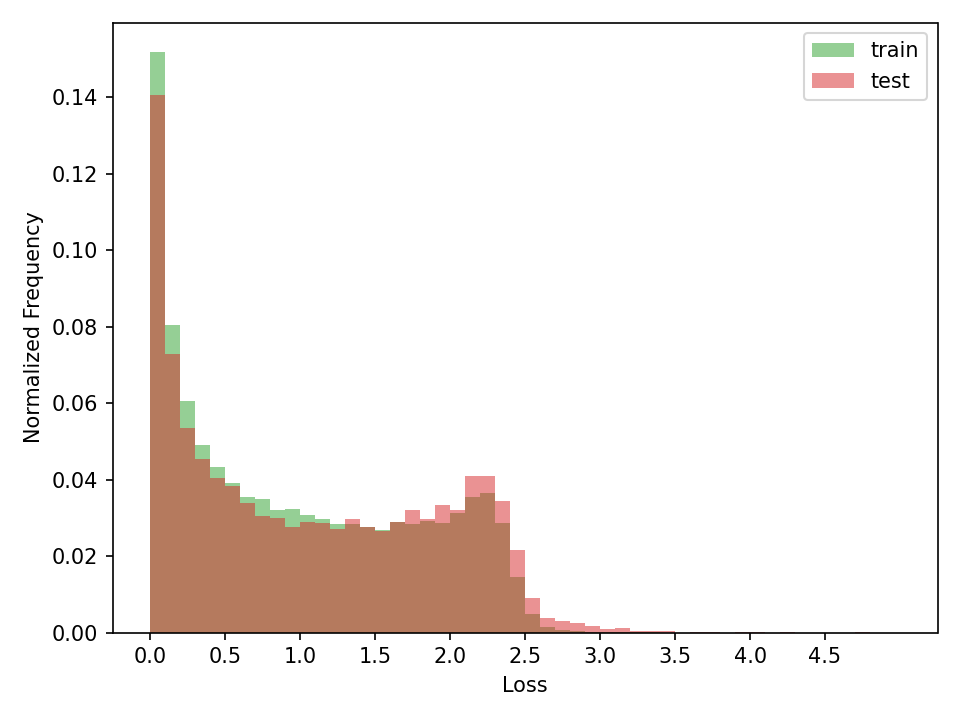

# RelaxLoss
This is a minimal implementation of the ICLR 22 paper titled [RelaxLoss: Defending Membership Inference Attacks without Losing Utility](https://openreview.net/forum?id=FEDfGWVZYIn) in PyTorch 1.11.
Paper introduces a defense against [membership inference attacks (MIA)](https://arxiv.org/abs/1610.05820) by developing an algorithm that makes loss distributions of member (train) and non-member (test) samples similar. I was able to replicate this effect (depicted in Figure 1 of the paper).


    

From left-to-right: Default training, RelaxLoss with α=0.5, RelaxLoss with α=1.0.

Simply run ```src/runner.sh``` to replicate those results. Code is also available in notebook format in ```notebooks/RelaxLoss.ipynb```.

I've also tested the algorithm against a simple [loss thresholding attack](https://arxiv.org/abs/1709.01604). Briefly, you know the avg. training loss of the model,
and you predict a sample 'member' if **sample loss < avg. training loss**. Concretely, a single run on [CIFAR10](https://www.cs.toronto.edu/~kriz/cifar.html) yielded the following results.


| Setting  | Train Acc | Test Acc | Train Avg. Loss / Var | Test Avg. Loss / Var | MIA Balanced Acc.
| ------------- | ------------- | ------------- | ------------- | ------------- | ------------- |
| Regular  | 100%  | 84.1% | 6.5e-4 / 3e-6 | 0.75 / 4.54 | 62.7% |
| RelaxLoss (α=0.5) | 94.3%  | 83.3% | 0.46 / 0.35 | 0.72 / 0.77 | 55.4% |
| RelaxLoss (α=1.0)  | 83.77%  | 79.6% | 0.97 / 0.61 | 1.07 / 0.7 | 52.2% |
